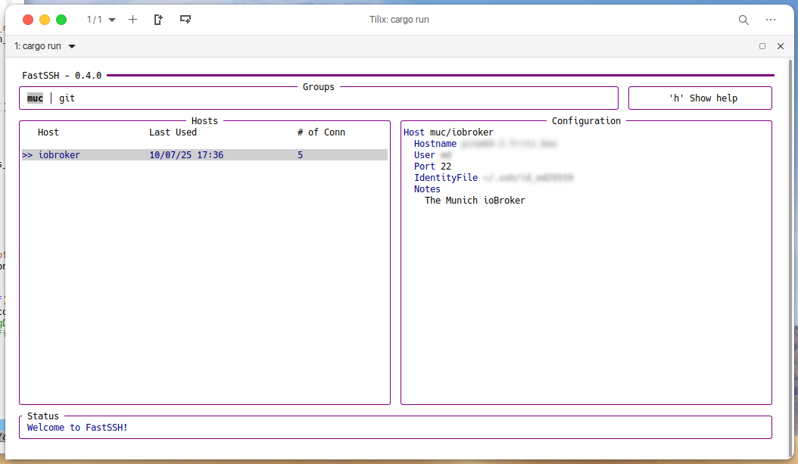

<div align="center">
    
    <br/>
    <b>Connect quickly to your services 🚀</b>
    <br/>
    <br/>
    <div>
        FastSSH is a TUI that allows you to quickly connect to your services by navigating through your SSH config.
    </div>
    <br/>
    <div>
        Forked from and inspired by <a href="https://github.com/Julien-R44/fast-ssh">Julien-R44/fast-ssh</a>
    </div>
    <br/>
</div>



# Installation

Currently, just the build from sources is supported.

Clone the repostory and execute:

```
cargo build --release
cargo install --path .
```

Then you can launch Fast-SSH with `fast-ssh`.

# Documentation
The default SSH configuration file should be located at `~/.ssh/config`. If you already have an SSH configuration file with some hosts defined then you don't have to add anything, Fast-SSH just parses this file and displays it. 

If you don't have an SSH configuration file or you don't have any hosts defined within it then below is an example to help you set one up for use with Fast-SSH. 

Further information about the SSH configuration file can be found at this link: https://linuxize.com/post/using-the-ssh-config-file/

You may add comments above the Host entries; these will be shown in the Configuration pane.


```
Host *
    UpdateHostKeys yes

# My desktop machine
# tags: desktop, x86_64
# group: muc
Host Desktop                            # Name of host you want to connect to, for use with Fast-SSH.
    HostName 192.168.1.10               # Hostname using an IP address, this can be a public or private one.
    User YourCoolUsername               # Username for the host you want to SSH into.

# My server machine
# tags: server, Sparc
# group: datacenter
Host Server                             # Name of host you want to connect to, for use with Fast-SSH.
    HostName 216.58.214.14              # Hostname using an IP address, this can be a public or private one.
    User YourCoolUsername               # Username for the host you want to SSH into.

Host AnotherServer                      # Name of host you want to connect to, for use with Fast-SSH.
    HostName example.com                # Hostname using a domain name.
    User YourCoolUsername               # Username for the host you want to SSH into.

# tags: pi
# group: RaspberryPi
Host RaspberyPi/Arch-Linux              # Defined group and name of host for use with Fast-SSH.
    HostName alarm-pi.local             # Hostname using a locally resolved address.
    User YourCoolUsername               # Username for the host you want to SSH into.

# tags: pi
# group: RaspberryPi
Host RaspberryPi/Raspbian               # Defined group and name of host for use with Fast-SSH.
    HostName raspbian.lan               # Hostname using a locally resolved address.
    User YourCoolUsername               # Username for the host you want to SSH into.
```

Fast-SSH has a group system. This allows you to sort your servers, for example, by project, mission or client. To make some groups, it's simple, just define your `Host` as `Group/ServerName` (see full configuration in above example) and your groups will be displayed in FastSSH. You can now select a group and display only the servers defined in that group. Now all you have to do is launch Fast-SSH, select your service and press enter to connect.

## File Database
A file database is stored at `$XDG_CONFIG_HOME/FastSSH/db.ron` ( `%APPDATA%/FastSSH/db.ron` for Windows ).

This file is automatically created when you launch Fast-SSH.
This database is used to store the number of connections to a service and the date of last connection.

## Search Mode
Fast-SSH implements a search mode ( fuzzy ) that allows you to type to find one of your hosts. To use it, press `s` or `/`, start typing, finish your selection with the arrow keys then press enter once the host is selected to make the SSH connection. Press ESC if you wish to leave the search mode and return to the "groups" mode.

## Shortcuts
| Key           | Action                               |
| ------------- | -------------                        |
| h             | Display Shortcuts Panel              |
| Enter         | Validate selection : Execute SSH cmd |
| Tab/BackTab   | Navigate through your groups         |
| Left/Right    | Navigate through your groups         |
| Up/Down       | Navigate through your hosts          |
| c             | Switch Config display mode           |
| PageUp/Down   | Scroll Configuration                 |
| s             | Enable Search Mode                   |
| Esc           | Exit Search Mode                     |
| q             | Exit Fast-SSH                        |


## Configuration
Fast-SSH has a few configuration options. You can find the configuration in :
- Unix : `$XDG_CONFIG_HOME/FastSSH/config.yaml`
- Windows : `%APPDATA%/FastSSH/config.yaml`

```
# This is the default configuration for FastSSH.

theme:
    text_primary: \"#000080\"
    text_secondary: \"#000000\"
    bg_primary: \"#d0d0d0\"
    bg_secondary: \"#c0c0c0\"
    border_color: \"#800080\"
```

# Known issues
If you are a user of the new Windows terminal and you encounter raw ANSI escape sequences when you run fast-ssh, you must unset the TERM environment variable before running the application. Read more about this here : https://github.com/crossterm-rs/crossterm/issues/580

Best solution would be to create an alias like this :
```
alias fast-ssh="TERM= fast-ssh"
```
